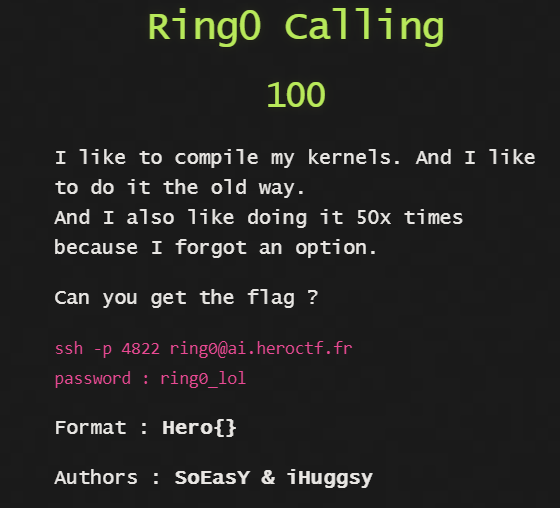

## Ring0 Calling - KERNEL



Run the qemu emulator using the given startup script /run

On looking around I found /BACKUP/syscall_64.tbl

This file lists out the syscalls available along with their respective syscall_numbers.
A user space program (Ring-3) can call these syscalls to make the kernel execute some instructions.
The kernel would do this with the highest privilege (Ring-0)

I found one special syscall by the name of ```sys_hero``` having number 442

```442	common	hero			sys_hero```

Clearly we are supposed to execute this syscall. This is done easily by doing
```c
#include <sys/syscall.h>

int main(void) {
    syscall(SYS_hero, ...);
}
```
but here we dont know about the actual implementation of ```sys_hero``` and what arguments it accepts.

Time to bring the big gun! ASSEMBLY

Put the syscall number in ```rax``` and the desired exit status in ```rdi``` registers respectively.

```Ctrl+Z``` and back to the host vm.

```bash
vim /tmp/tmp.akc55Yt/exploit.c
```

```c
int main(void) {
    unsigned long syscall_num = 442;
    long exit_status = 0;

    asm (
        "movq %0, %%rax\n"
        "movq %1, %%rdi\n"
        "syscall"
        :
        : "m" (syscall_num), "m" (exit_status)
        : "rax", "rdi"
    );
}
```

```bash
gcc -static /tmp/tmp.akc55Yt/exploit.c -o /tmp/tmp.akc55Yt/exploit.out
```

```fg``` go back to the emulator

```bash
/mnt/share/exploit.out
dmesg
``` 


